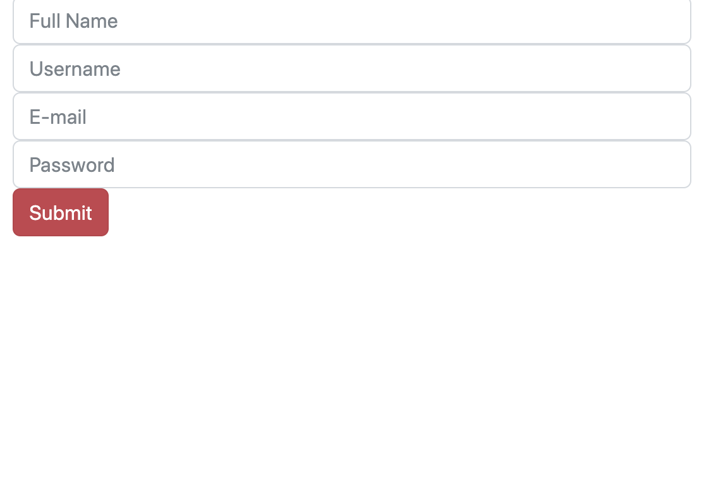
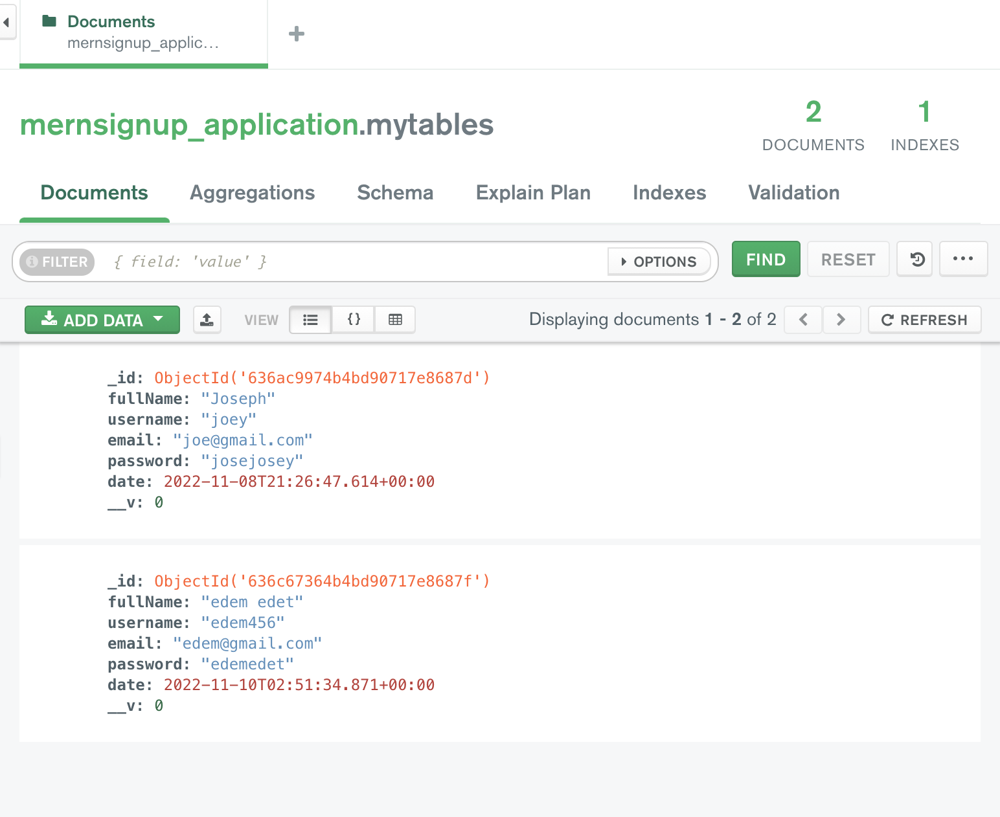

# MERN Stack Sign Up Application

Tutorial URL: https://www.youtube.com/watch?v=SQqSMDIzhaE
Tutorial description: In this video we learnt how to integrate a react frontend with a Node backend
And We did this by building a sign up application

___________

### Software versions
	NPM version: 8.19.2
	Node version: 16.17.0 
	Express version: 4.18.2
	React version: 18.2.0

## How to run 
1. Clone repository
2. CD into both directories and run "npm install"
3. CD into both directories and run "npm start"

## Problems in the project:
1. .gitignore not ignoring node_modules 
    -> Solution: Always create .gitignore first and install the node_modules second.
2.
	

### Photos of project:

## Apps used:
	- Postman 
    - MongoDB Compass
    - VS Code 
## Coding styles I used:

## What I learned
- Creating a /routes folder which is another folder organization pattern